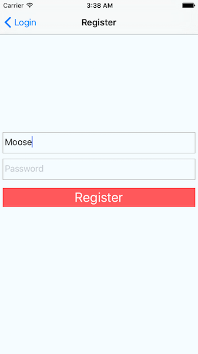
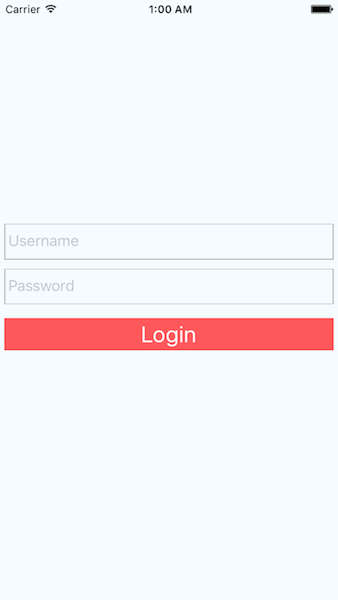
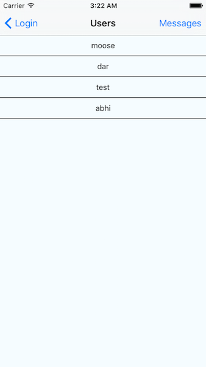
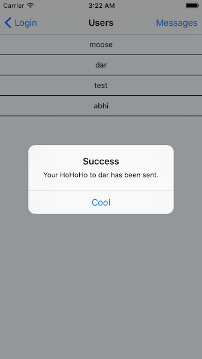
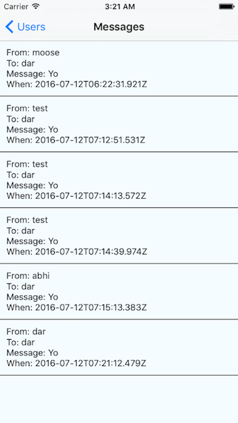

# Pair programming exercise: Ho! Ho! Ho!

## Goal

Your goal is to create a simplified clone of the [Yo
app](https://www.justyo.co/), a "contextual messenger" that lets you send a
simple "Yo" message to friends (if you haven't heard of Yo already, [read about
it here](http://www.businessinsider.com/whats-happened-to-7-million-app-yo-now-that-the-hype-has-died-2014-9)).
You'll build this app using React Native and run it on the mobile platform of
your choice, iOS or Android.

Your app will have the following features:

- Register
- Login
- List all users
- Send a HoHoHo to users
- List messages sent and received
- (Bonus) Implement pull to refresh

## Instructions

If you haven't already, make sure you install the Expo XDE from https://expo.io/tools
- We'll be using its live reloading features so we can see how each line of code
  changes (or breaks - Yikes!) our app.
- Now, try loading our demo app (built by our amazing TA, Corey): https://snack.expo.io/B1V9L-kSb
- Or perhaps, if you'd like to live on the dangerous side, so try loading this app with
  errors: https://snack.expo.io/BJ9rvWkrb
  - You don't have to fix it, but hopefully you see at least a couple problems with the code
  - Yet even with these errors, we can load the app onto our phones

After you've opened the project in Expo XDE, you can load the app on your phone by
clicking the `Share` button or typing the link but who's got time to type that,
scan the QR code with the expo app and let's go!

The backend is already hosted and provided for you at
https://hohoho-backend.herokuapp.com/ so take a look at the [See API documentation below.](#api)

**Seriously**, go read through it **now**

## Setup

1. Run npm install
2. Open the hohoho folder in Expo XDE and wait for it to finish opening
    - Project > open Project > Select the hohoho folder
3. Now, you can just edit the code with any text editor and Expo will live reload
  changes on your phone for you!
4. Expo XDE will now also stream any  **console logs/errors/warnings** from your phone to this window
5. **Before you continue**, try launching the app on your phone now to make sure it works

**IMPORTANT:** You can also reload manually if live-reloading doesn't seem to be working
  - Live reloading can be a bit finicky ¯\\\_(ツ)\_/¯ so if you aren't
    seeing your changes try manual reloading

**Note:** If you are having **connection issues**... (in order)
  - Make sure you don't have duplicate apps open in the background of your phone
  - Move on and try again in a couple minutes \- this usually does work, be patient
  - Try publishing and then normally connecting again
  - Press restart and/or restarting expo itself
  - Still nothing? Resist the urge to flip a table and ask for help in the
    queue + keep trying every now and then

## File Structure

| File/Folder | Description |
| ----------- | ----------- |
| assets/ | Contains any static app assets like images <br /> |
| img/ | Contains images used in this readme <br /> |
| App.js | The primary Expo file. Today, all of your react native code will go into this file |
| app.json | The Expo app configuration file |
| README.md | this file |

## Part 1. Registration

### Overview

For registration, we will be creating a screen that _looks like_ the following:




Your registration screen should be able to _do_ the following:

- Take a username as an input
- Take a password as an input
- Make a `POST` request to a server (API reference provided, see **_Endpoint Reference_**).


### Creating Components - `App.js [Register]`


Let's create the registration screen.

The first thing you'll notice are two react components for our login and register
screens. Don't worry, react native uses much of the exact same code and syntax from
React. See, your practically a react native developer already, now you just need to
learn how to use the extra features we have over plain react.

Further down, we have the boilerplate code for `React Navigation` as the
default export at the top of `App.js`. This specifies all of the components that we
wish to visit as screens of our app and which one is displayed initially.

We can use this navigator later to move forward and backward among a series of
screens in our app, for instance, from a Login screen to a Main screen. Don't
worry too much about this for now. The boilerplate code is already setup to work
with our two starting screens (register and login).

On the registration screen, use `TextInput` components for the form fields, with a
callback to pass the value to the state, like this:

```javascript
<TextInput
  style={{height: 40}}
  placeholder="Enter your username"
  onChangeText={(text) => this.setState({username: text})}
/>
```

Remember you may need to add/fix style for the above. Never just blindly copy
and paste code. You can find more information in [Handling text input](https://facebook.github.io/react-native/docs/handling-text-input.html).

> **Tip:** Note that TextInput component is something we imported. It's **always** a good
  idea to look at the docs + example code for any react native component we want to use

You will need two of these `<TextInput />` components, once for maintaining a state for `username`, and another storing state for `password`. Both of these will be used upon submitting the registration!

Now you need a way to actually use these two input fields so let's create ourselves a
submit button. Use `TouchableOpacity` for this, with an `onPress` handler (sound familiar?).
If you need an example for `TouchableOpacity`, take a look at the scaffolding for the
`<Login />` component we provided for you OR better yet, the official react native
documentation. If you want to hide the user input (say, for passwords), you can
simply add the prop: `secureTextEntry={true}`.

> **Tip:** We've also created some preset styles, such as `styles.button`, `styles.buttonBlue`,
`styles.buttonGreen`, and `styles.buttonRed`. Feel free to add your own styles in the
`StyleSheet` at the bottom or use ours!

Once you've got and validated the input values, you can make an HTTP POST
request with the username and password to the backend route like this:

```javascript
fetch('https://hohoho-backend.herokuapp.com/register', {
  method: 'POST',
  headers: {
    "Content-Type": "application/json"
  },
  body: JSON.stringify({
    username: 'theValueOfTheUsernameState',
    password: 'theValueOfThePasswordState',
  })
})
.then((response) => response.json())
.then((responseJson) => {
  /* do something with responseJson and go back to the Login view but
   * make sure to check for responseJson.success! */
})
.catch((err) => {
  /* do something if there was an error with fetching */
});
```

Instead of using `$.ajax()`, in React Native we use the `fetch` command to make
an HTTP request. The syntax is slightly different, since `fetch` returns a
promise. The `then` clause contains a success and an error handler. Read more
about this in [Networking](https://facebook.github.io/react-native/docs/network.html).

⚠️ **Warning:** Make sure to call `.then(response => response.json())` (like above) **before any other `.then` statements** (since each .then is run one after another) to turn the raw response into JSON that you can process in subsequent `.then`'s.

Awesome! If you've gotten a successful response from the server, now it's time
to take the user to the next screen of the app. Sounds scary but don't worry, the
`React Navigation` library makes it easy. Inside your success promise chain, call
`this.props.navigation.goBack()` to use the stack navigator we mentioned earlier to
bring us back to our previous view - the Login screen.

> **Tip:** If for some reason you haven't tested your code yet, \- you rebel \-
  test **now** before continuing on to part 2. You always want to test as often
  as possible because the longer you wait the more errors could build up and make it
  so much harder to debug them all at once


### End Result, Part 1

By the end of Part 1, make sure that you are able to access your registration view upon load of the app, enter in registration details (username and password), and successfully get a response back from the server. Upon successful registration, your app should bring you back to the Login view to login with the details you just registered with.

Congratulations! You've built your first native application view - in the next part, we'll build login in much the same way we did with registration, using `fetch` for handling network requests with our backend, and calling methods on `this.props.navigation` to bring us into different views.

## Part 2. Login

### Overview

For login, we will be creating a view that looks like the following:



Your login view will be able to do the following:
- Take a username through a text input
- Take a password through a text input
- Use `fetch` to verify a user that is logging in with the above inputs
- Push a new view upon success, and display an error upon failed authentication

### Creating Components - `App.js [Login]`

This view will be very similar to registration - we will only need to change the routes we use for `fetch` and change what happens upon success.

Build two `<TextInput />` components and a `<TouchableOpacity />` component within the `render()`
function of our `Login`, much like we did for our `Register` component in the previous step.

Use the defined `press()` provided as the `onPress` handler for that `<TouchableOpacity />`
component, which will do the following:

- Call `fetch` to request the login route and checking if the user's input matches a valid login.
  - Refer to the **_Endpoint Reference_** below for how to call our login route.
- If the `responseJson.success` is true, continue and navigate to a new view - a
  screen that displays all the users (we will create that next so for now,
  you can just navigate to the Register view).
  - **Remember:** navigating to the registration view will look like:

    ```javascript
    this.props.navigation.navigate('screenNameGoesHere')
    ```
  - **Careful - we will replace this later!** In the next step, we will modify this
    function (and the react navigation stack navigator) to navigate to a `Users` screen
    rather than the Register screen again. We will let you know when that needs to happen!
- If `responseJson.success` is not true, display a message with the error from the response.
  - To display a message to the user, set a property to your state (with `setState`) and create a `<Text>` component like the following that updates with your state:

    ```jsx
    <Text>{this.state.message}</Text>
    ```

### End Result, Part 2
At the end of Part 2, you should be able to both register and login; successful logins will bring up the registration view again, but we will change this in the next part.

**Note that all new requests will now automatically be authenticated, thanks to cookies!**
 No need to store a username, password, or token for this simple app.

## Part 3. User list
### Overview

Now that we've successfully logged into our app, we will create a list view for displaying our users that we are able to send messages to. The result will look like the following:



Your users view will be able to do the following:

- `fetch` all users from the database
- Display the result of this `fetch` in a list view with all usernames of each user
- Upon tapping any of the displayed users, another `fetch` should be called to send a "HoHoHo" to the tapped user (from the user that is logged in)

We'll break this down into sections: first, we'll just handle displaying a list of
users, and then, we'll use `fetch` to display the correct list of users.

### Creating Components - `App.js [Users]`

The main screen of your app is going to contain a list of the user's friends;
tapping one of them would "Ho! Ho! Ho!" them.

Create the Users component and include this variable that you may have notice in
our other two components...

```javascript
static navigationOptions = {
  title: 'Users' //you put the title you want to be displayed here
};
```

This variable essentially tells React Navigation how you want to display the screen.
Here, we only set the title of the screen but using this same variable, we could
change colors, add buttons to the header bar, and a number of other things. We'll
get back to this later. Just know that while not required, you need it if you want to
display a title in the header bar of the screen.

The easiest and most natural way to display a list of data in React Native is by
[Using a ListView](https://facebook.github.io/react-native/docs/using-a-listview.html).

Take a look at the top of your `App.js` and spot a line that looks like:

```javascript
import {
  ...
  ListView
} from 'react-native'
```

This import statement allows us to use `ListView` throughout the rest of our
app \- we've done this for you!

Next, we need to add something called a _data source_ to the state for the
`Users` component. In React you learned to do this using the
`constructor`! Use this knowledge to add your data source to your view upon
`state`. For now we'll make it contain a static list of friends:

```javascript
class UsersScreen extends React.Component {
  //navigationOptions code
  constructor(props) {
    super(props);
    const ds = new ListView.DataSource({rowHasChanged: (r1, r2) => r1 !== r2});
    this.state = {
      dataSource: ds.cloneWithRows([
        'Moose', 'Corey', 'Allie', 'Jay', 'Graham', 'Darwish', 'Abhi Fitness'
      ])
    };
  }
}
```

Let's render the list view. Inside the main `<View>` component in the `render`
method for this `Users` view, add a list view component like this:

```javascript
<ListView
  dataSource={this.state.dataSource}
  renderRow={(rowData) => <Text>{rowData}</Text>}
/>
```

Now that we've created our `Users` component, we can add it to the stack navigator
Take a look at the object we pass in as the first parameter to StackNavigator...

```javascript
{
  Login: {
    screen: LoginScreen,
  },
  Register: {
    screen: RegisterScreen,
  },
}
```

Any guesses as to what we need to change so we can navigate to this new Users
component/screen? Yep, we're just going to add a new key called `Users` that contains
an object with the key `screen` and value `componentName` so in total, something like this...

```
Users: {
  screen: ComponentNameGoesHere
}
```

To tie it all together, we go back and modify the `.then()` within the `fetch`
of your `Login` component to

```javascript
this.props.navigation.navigate('Users')
```

This will make sure that after Login, our view changes to the new Users screen
instead of back to our Registration screen.

Boom! Now we have a list of friends in our app. Kinda. Of course,
there's no data yet, so the list never changes and you can't add to it, but,
hey, if you're gonna have a static list of friends, that's a hell of a list!

### Checkpoint, Part 3
At this point, you should be able to register, login, and view a static list of users
that currently do nothing. In the next section, we will fetch a list of users and
add an `onPress` handler to send a _Ho Ho Ho!_ to any user we tap.

### Creating More Components - `App.js [Users]`

Now, implement `fetch` inside of your `constructor`'s this.state to load up an array of real users rather than a list of static users.

```javascript
.then((responseJson) => {
  this.setState({
    dataSource: ds.cloneWithRows(/* replace this with the array
                                      * of users you receive in
                                      * the response of fetch! */)
  });
});
```

⚠️ **Note:** Use `this.setState` when you receive the results back from `fetch` and return an empty
array (`ds.cloneWithRows([])`) for your `dataSource` in the `constructor`\'s this.state. This way, your
initial state will be zero rows, but the new rows will be set once we fetch the users from the server.

We will also need to modify your `render` function to handle our response correctly, since
`responseJson` is now an array of _objects_. Change the `<Text>` component within each `renderRow` of
your `<ListView />` to:

```jsx
<ListView
  ...
  renderRow={(rowData) => <Text>{rowData.username}</Text>}
/>
```

### End Result, Part 3

By Part 3, you will be able to login, register, and view all usernames returned by our backend. Tapping them will do nothing yet, but we will take care of that in the next part!

> **Tip:** Again, now would be a great time to test everything you've written so far if you haven't already

## Part 4. Send a HoHoHo

### Overview

Next, we will be handling the logic for sending a _Ho Ho Ho!_ to another user in our user list. The end result will look something like the following:



This component should be able to accomplish the following on the tap of a row:
- Use `fetch` to send a request to our backend server to _Ho Ho Ho!_ another user
- Alert with either the success or response of a _Ho Ho Ho!_

### Adding to Components - `App.js [Users]`

First, create a new function inside of the `Users` class (the same class that we created a `constructor` to `fetch` existing users in the previous part) called `touchUser`. This `touchUser` will take a parameter called `user` (which we will bind later to pass us a _specific user_ every time we tap on their corresponding row in the `<ListView>`).

Inside of this `touchUser` function, use `fetch` and create a request that sends a _Ho Ho Ho!_ to another user by the `_id` property of the parameter `user`. That is, in the `to` parameter of `POST /messages` (refer to **_Endpoints Reference_** down below!), pass in `user._id`.

Within the `.then` of this `fetch` (_**don't forget** to `.json()` the response with another `.then` before this!_), we want to alert based on whether or not the request completed successfully or not. Here is an example of how we display an [alert with React Native](https://facebook.github.io/react-native/docs/alert.html):

```javascript
Alert.alert(
  'Alert Title',
  'Alert Contents',
  [{text: 'Dismiss Button'}] // Button
)

```

If `responseJson.success` is true, display an alert that says "Your _Ho Ho Ho!_ to `THE_USERNAME` has
been sent!" If not, display an alert with an error saying "Your _Ho Ho Ho!_ to `THE USERNAME` could not be sent."

Next, recall the following lines of code from the `render()` function of our `Users` view component:

```jsx
<ListView
  ...
  renderRow={(rowData) => <Text>{rowData.username}</Text>}
/>
```

Here, all we are displaying is a simple `<Text>` component inside of each row of our `<ListView>` to
show the username of each user. To make each of these rows "tappable," we will now wrap the `<Text>`
component inside of a `<TouchableOpacity>` component, just like we did for our Login and Register buttons from earlier.

Add to the `renderRow` prop of the `<ListView>` component and put the `<Text>` component returned
_inside of_ a `<TouchableOpacity>` component. Pass an `onPress` prop to the `<TouchableOpacity>` that
calls the `touchUser` function you wrote and pass in `rowData` to the function.

You can do this by binding like the following:
```jsx
<TouchableOpacity onPress={this.touchUser.bind(this, rowData)}... />
```

The goal here is to call `touchUser` on pressing any of the rows and pass in an object to the `touchUser` function representing the user corresponding to the row.

The `touchUser` function will then take the `_id` of the user object passed in and create a request to send the _Ho Ho Ho!_

### End Result, Part 4

By Part 4, you will now be able to tap on anyone's name and send them your very own _Ho Ho Ho!_ You
aren't able to receive any _Ho Ho Ho!_'s yet, though - we'll fix that in the next part!

## Part 5. Messages list

### Overview

For this part, we will create a new view that displays all messages sent and received
from a current user. This view will look something like the following:



This view will be able to _do_ the following:
- Display all messages sent and received from a logged-in user
- (_Optional_) Visually distinguish between messages sent and messages received

### Creating & Modifying Components - `App.js [Users, Messages]`

Start by creating a new class called `Messages` that has a `constructor` similar to that of your `Users` component. Refer to **_Endpoints Reference_** for how to `fetch` all the messages sent and received by your currently logged-in user.

> **Tip:** Base this off of the `constructor` of your `Users` component.  Create a `fetch` promise
  that calls `setState` upon succesfully retrieving messages and return `ds.cloneWithRows[]` outside of
  the promise. Make sure this property of your state is called `messages` and not `users`!

Additionally, don't forget about the `navigationOptions` static variable. We want a title!
Reference how we've done it in other classes if you need to.

Implement the `render()` function for the `Messages` class that displays the following details about our message:

- The username of the sender (`aMessage.from.username`)
- The username of the receiver (`aMessage.to.username`)
- The timestamp of the message (`aMessage.timestamp`)

<sub>*Where `aMessage` represents any message object as part of the  `responseJson.messages` array!</sub>

> **Tip:** Again, this should be based off of the `render` function of your `Users` component. Create a `<ListView>` that renders rows of messages with the contents above.

Now we need something that will navigate to this new = `Messages` view.

First, modify the `Users` component of your `App.js` by **adding a function** called
`messages()` that will navigate to the messages component with `this.props.navigation.navigate`,
just like we did with `Users` earlier. We will use this function later.

Now, add the Message Component as a screen to the Stack Navigator (just we did with the `Users`
component earlier) so we can actually navigate to it. The navigate() function from
React Navigation can only go to screens that have been defined when we make and
export that StackNavigator)

At this point, your `Users` component should have the following functions:

- `constructor` - populate the list of users
- `touchUser` - the `onPress` handler for clicking a user from the list (_it might not be called this, depending on the way you implemented it!_)
- `messages` (**you just created this!**) - the function that navigates to the `Messages` view on the navigator stack
- `render` - the render function for your `Users` component

Notice a problem, we spent all this time making the Message component and a function inside
Login that will navigate to it but we never call it. What?! Let's fix this now by adding
a button to the header bar at the top of this Login screen. We do this by modifying
`LoginScreen`'s `navigationOptions` variable.

We mentioned earlier that this variable can do a lot and more specifically, one
thing we can do is add a header button. Just like we defined the `title` key for a title,
we define the `headerRight` key to modify that portion of the header (in this case, to add a button).

```
<Button
  title='Messages'
  onPress={}
/>
```

Note how we can just throw in jsx. We could have added anything we wanted there
but we just wanted a button with an onPress property.

One big problem though, this won't work. What gives? Well, react navigation won't be able to see our
`messages` function so we're going to have to switch to dynamic navigationOptions instead of static.
You can read up about what this means on the [official documentation](https://reactnavigation.org/docs/navigators/navigation-options) or just follow along...

To do this, we make our static navigationOptions a function like so

```javascript
static navigationOptions = ({ navigation }) => ({
  title: 'Users',
  headerRight: <Button title='Messages' onPress={ () => {navigation.state.params.onRightPress()} } />
});
```

and then we need to define onRightPress within the navigators state params so let's do this
in a good ol componentDidMount like so...

```javascript
componentDidMount() {
  this.props.navigation.setParams({
    onRightPress: yourHandlerFunctionGoesHere
  })
}
```

Add your handler function and don't forget to bind

Wow, isn't that the most beautiful button you've ever seen? Now we can actually
get to the `Messages` screen from our `Users` screen. Give it a try!

### End Result, Part 5

By this step, you should be able to perform all parts of the initial app functionality outlined: registration, login, sending _Ho Ho Ho!_ 's to other users and being able to see all the _Ho Ho Ho!_ 's you have sent and received as a logged-in user.

Congratulations! You've finished your first React Native application!


## Bonus: Pull to refresh

Update your message and user views to be able to perform a
[pull to refresh](https://facebook.github.io/react-native/docs/refreshcontrol.html).


## <a id="api">API Reference</a>

**Base URL:** https://hohoho-backend.herokuapp.com/

All endpoints accept JSON data and return JSON data. All responses include
a boolean `success` field that indicates if request was successful.
You can also use the response status code to figure out if a request
was successful.

- `POST /register`: Register a new user. Does **not** automatically log user in.
  - Parameters:
    - `username`: Required String
    - `password`: Required String
  - Response codes:
    - `400`: Bad user input, includes `error` field indicating cause
    - `200`: Registration successful
- `POST /login`: Log in as a pre-existing user.
  - Parameters:
    - `username`: Required String
    - `password`: Required String
  - Response codes:
    - `400`: Bad user input, includes `error` field indicating cause
    - `401`: Bad username or password, includes `error` field indicating cause
    - `200`: Login successful
- `GET /login/success`: Check if the user is logged in
  - Parameters: **none**
  - Response codes:
    - `401`: User is not logged in
    - `200`: User is logged in
- `GET /users`: Get all registered users in HoHoHo
  - Example response:

    ```javascript
    {
      "success": true,
      "users": [
        {
          "username": "moose",
          "_id": "57844cbdbedf35366e2690d3"
        },
        {
          "username": "dar",
          "_id": "57846e7666b869d88ad96430"
        },
        {
          "username": "other",
          "_id": "57846fea0ccbba228cd1479e"
        },
        {
          "username": "other2",
          "_id": "57846ff00ccbba228cd1479f"
        }
      ]
    }
    ```

- `GET /messages`: Get messages sent to and from current user
  - Example response:

    ```javascript
    {
      "success": true,
      "messages": [
        {
          "_id": "57846f6cafacd3988b4362e6",
          "to": {
            "_id": "57846e7666b869d88ad96430",
            "username": "dar"
          },
          "from": {
            "_id": "57844cbdbedf35366e2690d3",
            "username": "moose"
          },
          "__v": 0,
          "body": "Yo",
          "timestamp": "2016-07-12T04:17:48.304Z"
        }
      ]
    }
    ```

- `POST /messages`: Sends a message/_Ho Ho Ho!_ to another user
  - Parameters:
    - `to`: the ID of the user you are sending a message to
  - Response codes:
    - `401`: User is not logged in
    - `400`: There was an error saving to database
    - `200`: The _Ho Ho Ho!_ was sent!
  - Example response:

    ```javascript
    {
      "success": true,
      "message": {
        "__v": 0,
        "to": "57849dac19a9131100ab2fe5",
        "from": "578533b8787e661100aec76a",
        "_id": "5785397a787e661100aec7d6",
        "body": "HoHoHo",
        "timestamp": "2016-07-12T18:39:54.406Z"
      }
    }
    ```
